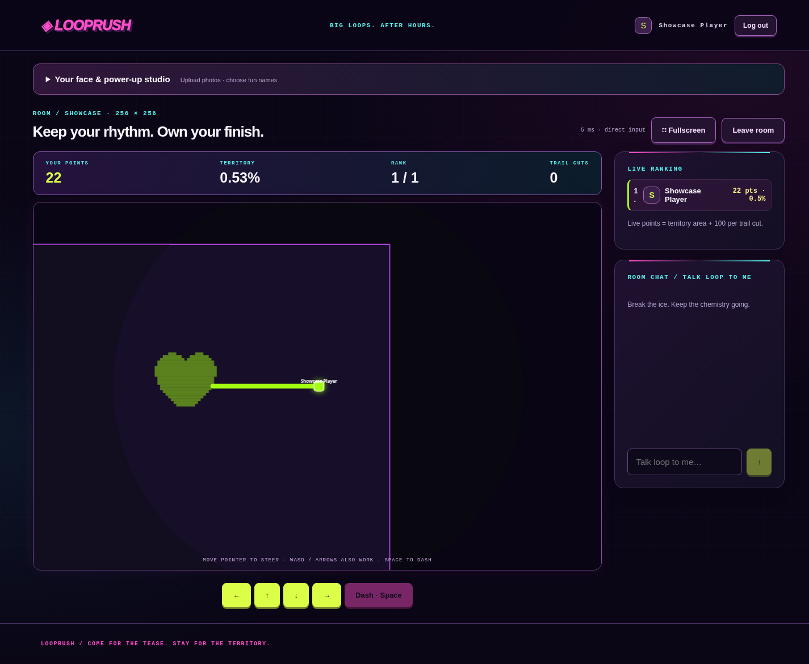

# Looprush

A fast, friendly multiplayer territory game. Run it locally with Docker:

```sh
docker compose up --build
```

Open [http://localhost:8000](http://localhost:8000).

## Screenshots

| Lobby | Live match |
| --- | --- |
|  |  |

**Content note:** The game uses sexual innuendo and suggestive jokes in its theme and interface. These references are fictional and included just for fun; the game is not explicit sexual content.

## License

MIT. See [LICENSE](LICENSE).
